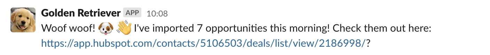

[](https://github.com/dxw/golden_retriever/actions)

# Golden Retriever

Golden Retriever imports opportuntities from the [Digital Marketplace](https://www.digitalmarketplace.service.gov.uk/digital-outcomes-and-specialists/opportunities) into Hubspot and drops an alert into our Slack like this:



It is run every weekday at 9am (UTC) via a [Github Action](https://github.com/dxw/golden-retriever/blob/master/.github/workflows/run.yml).

## Getting started

Clone the repo:

```bash
git clone git@github.com:dxw/golden-retriever.git
```

Run the setup script:

```bash
script/setup
```

This script installs all the necessary dependencies and sets up all the required
environment variables detailed in [.env.example](https://github.com/dxw/golden-retriever/blob/master/.env.example), so make sure you have these to hand ([More on environment variables](https://github.com/dxw/golden-retriever#environment-variables)).

## Environment Variables

You must have the following required environment variables set in the `.env` file for
the application to function as expected:

- `HUBSPOT_API_KEY`: The API key for your Hubspot instance. This can be retrieved / generated in Hubspot in Settings > Integrations > API Key
- `HUBSPOT_PORTAL_ID`: The ID of the Hubspot portal that you want to import the opportunities into. You can see this below the name of your portal when logged into Hubspot
- `SLACK_WEBHOOK_URL`: The Slack Webhook that you will use to send a Slack notification once the import has run successfully. This should start with `https://hooks.slack.com`. [More on Slack webbooks](https://api.slack.com/messaging/webhooks)
- `HUBSPOT_PIPELINE_ID`: The ID of the Hubspot pipeline you want to import into. You can see a list of all your pipelines and their IDs via the [Hubspot API](https://developers.hubspot.com/docs/api/crm/pipelines)
- `HUBSPOT_DEAL_STAGE_ID`: The ID of the Hubspot deal stage you want to import into (this will probably be something like "For review"). You can see a list of all your deal stages and their IDs via the [Hubspot API](https://developers.hubspot.com/docs/api/crm/pipelines)
- `HUBSPOT_LIST_ID`: The ID of the Hubspot list that you want the Slack Notification to link to. This will probably be a filter you've set to view all deals that are marked "for review". You can get this from a list's URL once it's been set up (in the format `https://app.hubspot.com/contacts/PORTAL_ID/deals/list/view/LIST_ID/`)

## Running

To import the newest opportunities run the following:

```bash
bundle exec rake opportunities:import
```

You'll probably want to run this as a daily scheduled task. We use [Github Actions](https://github.com/dxw/golden-retriever/blob/master/.github/workflows/run.yml) for this
